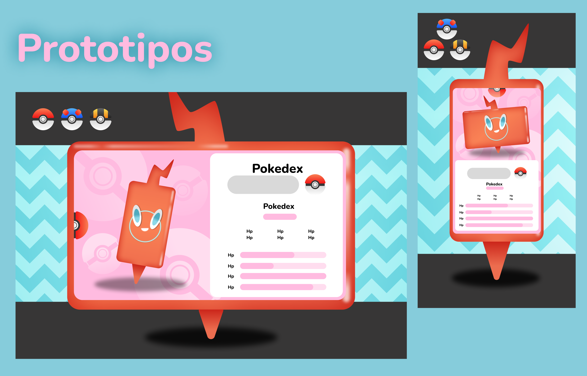

# Pokédex interactiva con PokeAPI

Una Pokédex interactiva implementada con HTML, JavaScript y CSS avanzado, utilizando la PokeAPI para obtener información sobre los Pokémon. Está inspirada en el rótom-phone una de las últimas versiones de la pokedex 

## Características

- Interfaz intuitiva, creativa y amigable.
- Utilización de animaciones y efectos avanzados en CSS.
- Integración con la PokeAPI para obtener información actualizada sobre los Pokémon.

## Referencias y prototipo en figma




## Tecnologías Utilizadas

- HTML5
- JavaScript (ES6+)
- CSS3 (con variables para colores y animaciones)

## Instalación

1. Clona el repositorio:

   ```bash
   git clone https://github.com/TU_USUARIO/TU_PROYECTO.git
